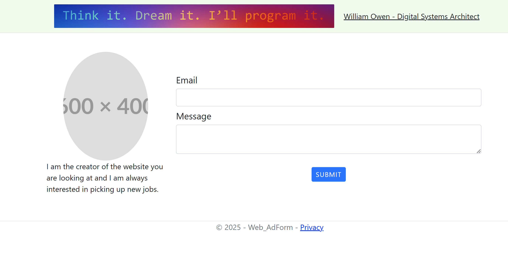

# Advertisement Project

This is a CPTC project demoing model binding with ASP.NET MVC.

I chose to make a project that I could use and integrate with other projects later.

I want an Ad or a series of Ads that help get people in touch with me.

I want the ability to add them to websites or change them style-wise on the fly for websites, and I want to be able to collect data. I'll also want to secure that data, so not everyone can view it.

The ad should be slim element block in the dom. As the user scrolls by, they can click it and it'll expand giving more info about my services, and offer a direct way to contact me.

Iframes will be used to inject the ad wherever needed.

